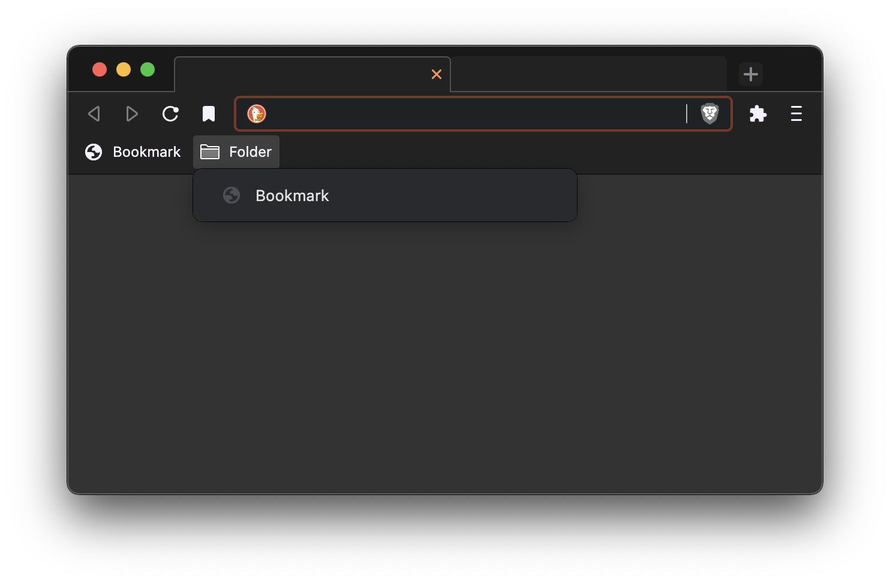
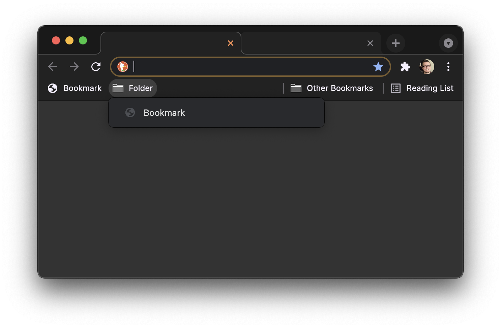
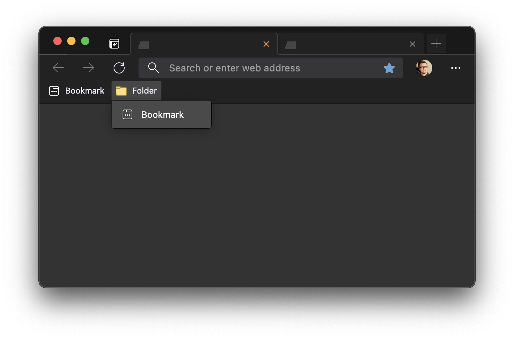

Monokai Pro (Filter Spectrum) Themes
====================================

The repository contains a collection of application themes based on the VS Code theme [Monokai Pro](https://monokai.pro/); specifically the **Monokai Pro (Filter Spectrum)** variant that visually aligns with the **MacOS Big Sur** dark theme.

> Other Monokai Pro variants may be including in the future (pull requests welcome).

## VS Code Reference

A view of VS Code with the [Monokai Pro](https://monokai.pro/) theme applied. Shown here for reference.

## Brave, Chrome, and Edge

All browsers are show with New Tabs and the [Dark New Tab](https://chrome.google.com/webstore/detail/dark-new-tab/mnjmegebbljjhpljjfjmkhgmokpmdbpo) extension.

### Brave

### Chrome

### Edge

## iTerm2

Terminal Session

## Alfred 4

> Note: The light corners are a result of the screen capture software and do not appear when using the theme.

Empty Search

Search with Results

# Recommendations

