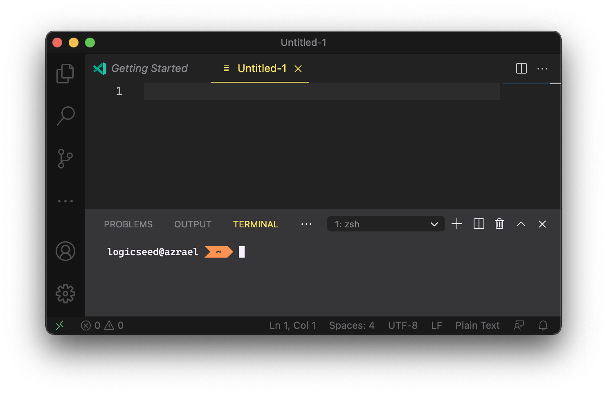
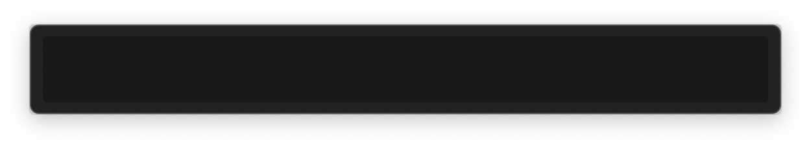
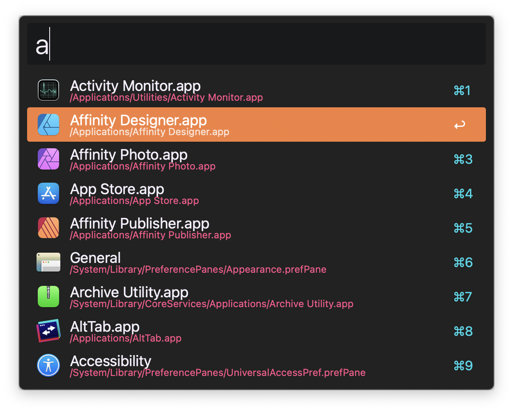
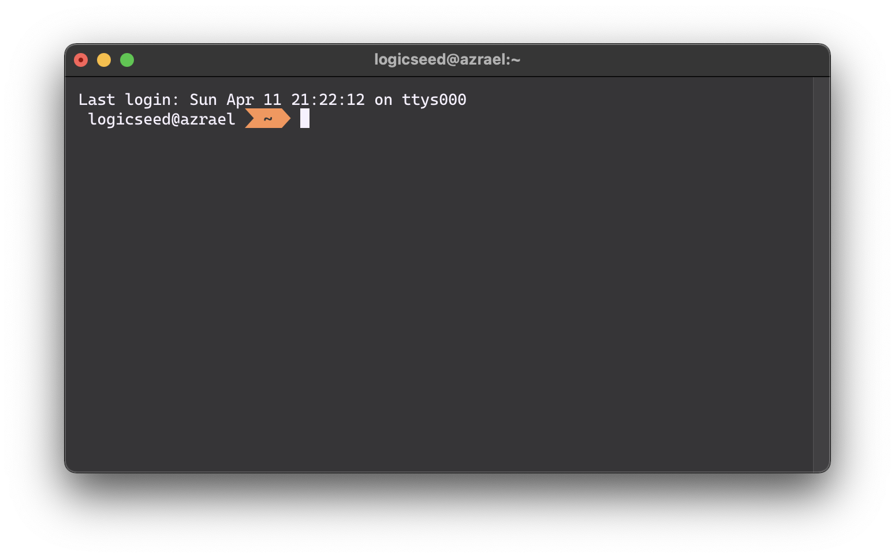
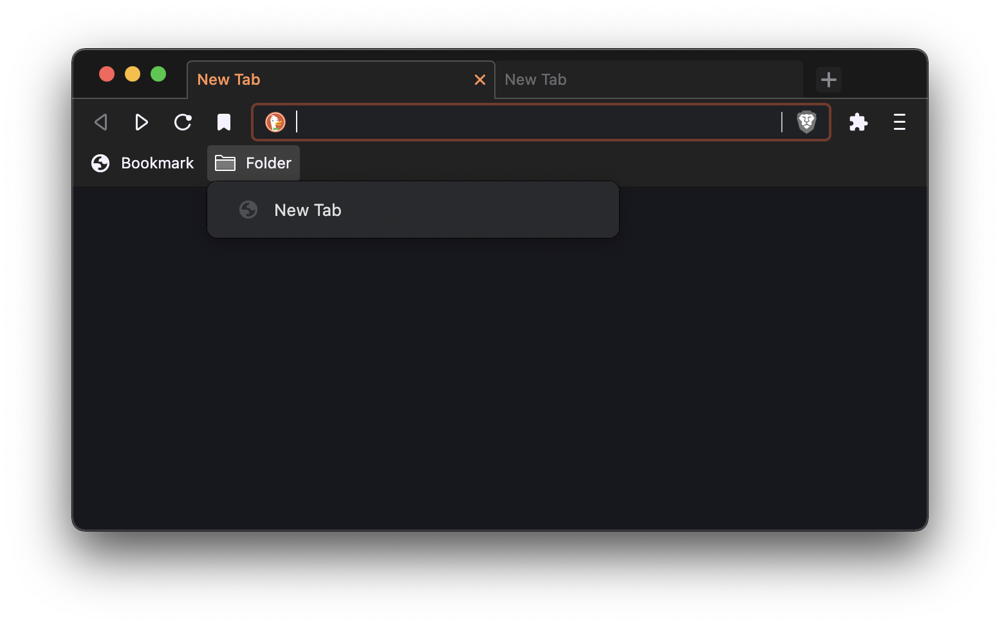

Monokai Pro (Filter Spectrum) Themes
====================================

The repository contains a collection of application themese based on the VS Code theme [Monokai Pro](https://monokai.pro/); specifically the **Monokai Pro (Filter Spectrum)** variant that visually aligns with the **MacOS Big Sur** dark theme.

> Other Monokai Pro variants may be including in the future (pull requests welcome).

## VS Code Reference

A view of VS Code with the [Monokai Pro](https://monokai.pro/) theme applied. Shown here for reference.

## Alfred 4

> Note: The light corners are a result of the screen capture software and do not appear when using the theme.

Empty Search

Search with Results

## iTerm2

Terminal Session

## Brave, Chrome, and Edge

Brave

# Recommendations

